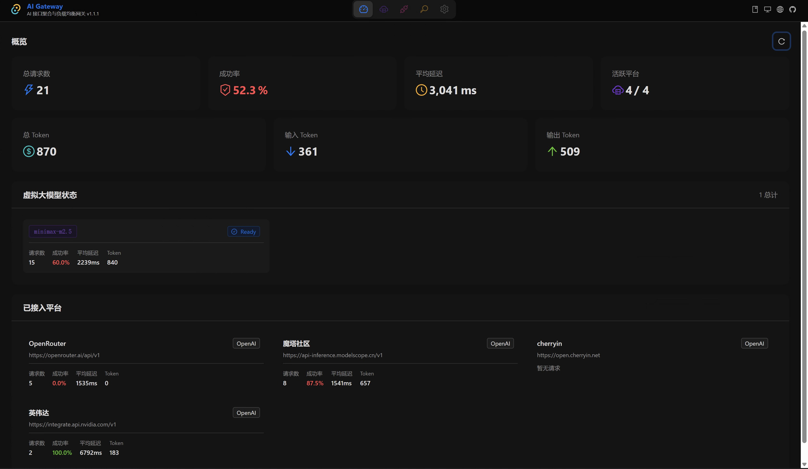
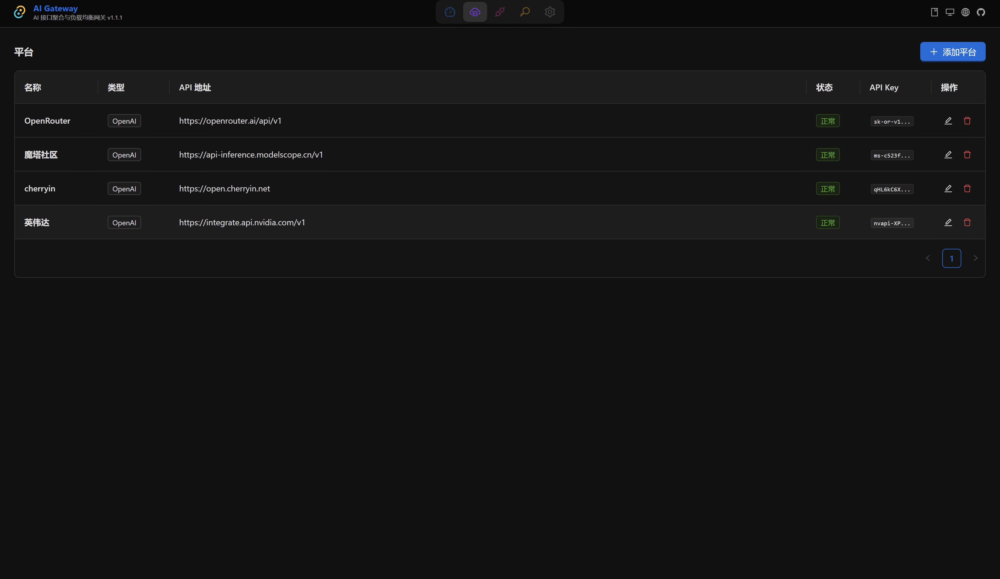
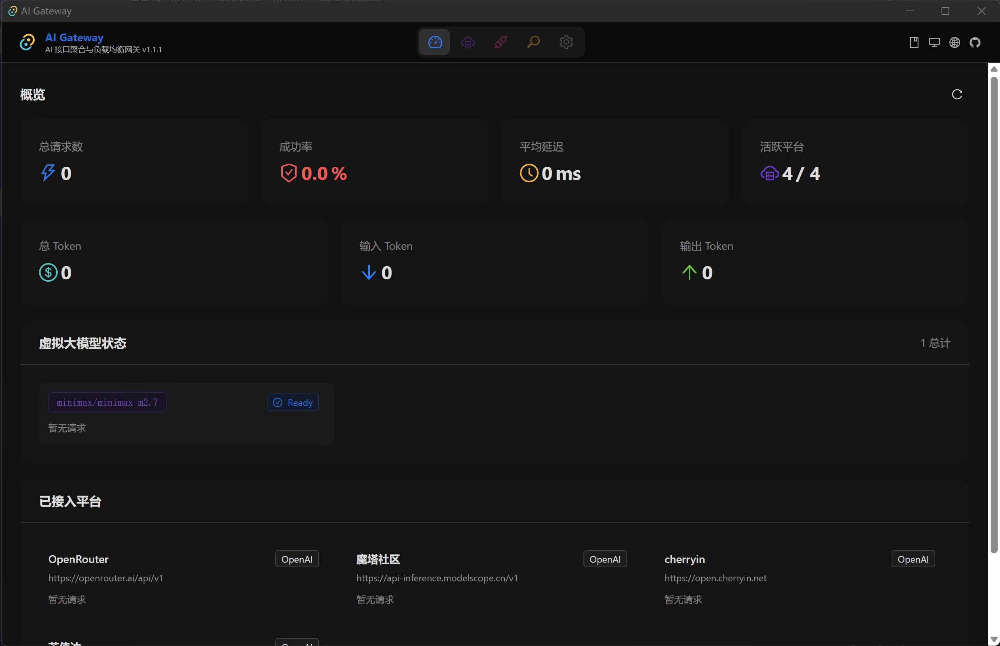
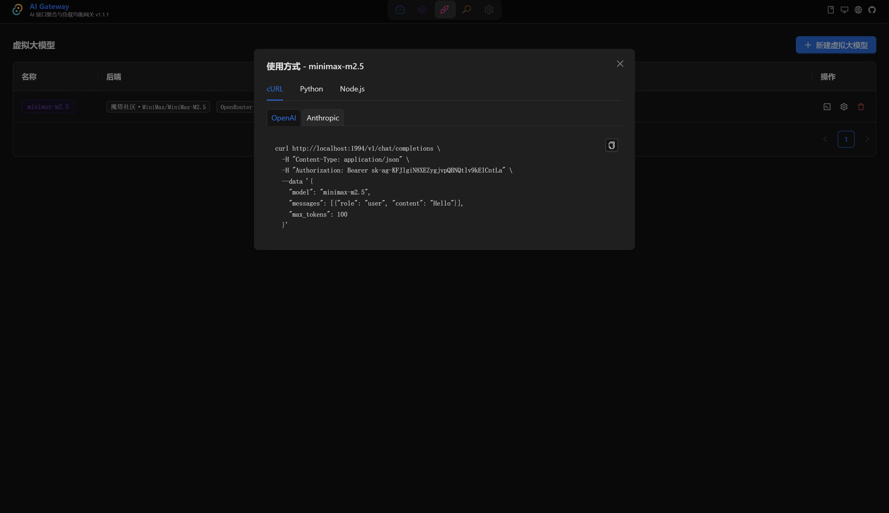
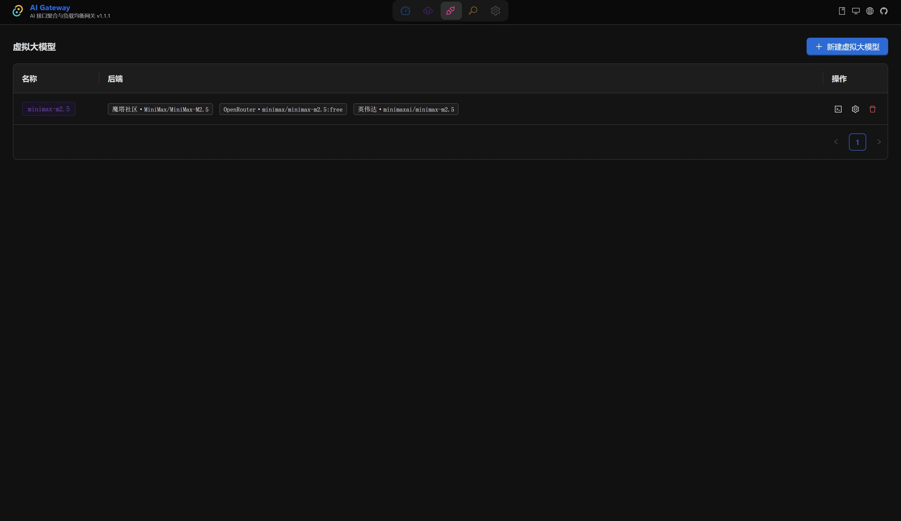

<p align="center">
  
</p>

<p align="center">
  
  
  
  
</p>

<h1 align="center">🚀 AI Gateway</h1>

<p align="center">
  <strong>跨平台 AI 接口聚合与智能流量负载均衡工具</strong><br/>
  统一接入 OpenAI · Anthropic · Google Gemini · DeepSeek · Qwen · 月之暗面 · 智谱AI · 豆包 · Ollama · NVIDIA NIM · Azure · 更多...<br/><br/>
  <strong>双协议原生支持：</strong>同时兼容 OpenAI 与 Anthropic Messages API 格式，一个网关覆盖全部生态
</p>

<p align="center">
  <a href="README.md">中文</a> | <a href="README_EN.md">English</a>
</p>

---

## 📸 应用截图

<p align="center">
  
</p>
<p align="center"><em>主界面 — 虚拟大模型管理</em></p>

<p align="center">
  
</p>
<p align="center"><em>平台管理 — 添加与配置 AI 平台</em></p>

<p align="center">
  
</p>
<p align="center"><em>虚拟模型 — 后端配置与负载均衡策略</em></p>

<p align="center">
  
</p>
<p align="center"><em>统计概览 — Token 用量与请求统计</em></p>

<p align="center">
  
</p>
<p align="center"><em>设置页面 — 端口配置与主题切换</em></p>

---

## 🔥 为什么选择 AI Gateway？

### 💡 多 Key 负载均衡，突破 AI 平台限流

很多 AI 平台提供免费额度，但做了严格的请求频率限制（如每分钟 3 次、10 次等）。AI Gateway 的核心能力就是帮你**用多个 API Key 通过负载均衡将请求分发到不同 Key 上**，变相将频率限制翻 N 倍：

```
你的应用（高频请求）
    │
    └──→ AI Gateway 智能负载均衡 ──┬── Key 1: sk-free-xxx1（3 RPM）
                                    ├── Key 2: sk-free-xxx2（3 RPM）
                                    ├── Key 3: sk-free-xxx3（3 RPM）
                                    └── Key 4: sk-free-xxx4（3 RPM）
                                        ↓
                            总吞吐量：4 × 3 = 12 RPM 🚀
```

**操作方式超级简单**：
1. 在「平台管理」中，同一个 AI 平台添加多次，每次填入不同的 API Key
2. 在「虚拟大模型」中，把这些同一平台不同 Key 的模型都加为后端
3. 选择负载均衡策略，一键启动 — 请求自动分发到各 Key

> 不只是免费平台！即使付费平台，多 Key 负载均衡也能显著提升并发吞吐量、避免单 Key 限流导致的请求失败。

### 🔀 5 种智能负载均衡策略

| 策略 | 说明 | 适用场景 |
|------|------|----------|
| **轮询 (Round Robin)** | 依次将请求分配到各后端，循环往复 | 多 Key 限流突破：均匀分摊请求到各 Key |
| **加权随机 (Weighted Random)** | 按权重随机分配，高权重后端获得更多请求 | 后端性能差异大，按配额分配 |
| **最少连接 (Least Connections)** | 优先选择当前活跃连接数最少的后端 | 长连接/流式场景，避免单点过载 |
| **优先级 (Priority)** | 主备模式，高优先级后端优先，故障自动切换 | 成本优化：便宜 Key 优先，贵 Key 兜底 |
| **延迟优先 (Latency Based)** | 实时追踪各后端响应延迟，优先选择最快后端 | 对延迟敏感的在线服务 |

### 🌐 双协议原生支持

AI Gateway 不仅仅是 OpenAI 兼容代理 — **原生支持 Anthropic Messages API 协议**，无需任何协议转换中间件：

```
你的应用代码
    │
    ├── 使用 OpenAI SDK ──────→ POST /v1/chat/completions ──┐
    │                                                       │
    └── 使用 Anthropic SDK ──→ POST /v1/messages ───────────┤
                                                            │
                                                      AI Gateway
                                                            │
                                          ┌─────────────────┼─────────────────┐
                                          ↓                 ↓                 ↓
                                      DeepSeek            Qwen            OpenAI
                                     (权重 3)           (权重 2)          (权重 1)
```

### 🛡️ 高可用 & 智能重试

- **自动故障切换**：某个后端宕机，流量自动切换到健康后端
- **智能重试**：429 限流、5xx 服务错误、超时等自动重试，支持指数退避
- **零代码改造**：客户端只需将 API Base URL 指向 AI Gateway，无需任何修改

---

## ✨ 更多特性

- **一键添加平台**：内置 15+ 主流 AI 平台预设（含 Google Gemini），点击即用
- **远程模型获取**：配置后端模型时自动从平台 API 拉取可用模型，下拉选择无需手动输入
- **智能能力识别**：模型能力根据预设自动填充（聊天/代码/视觉/函数调用等），支持手动修改
- **reasoning_content 支持**：兼容 NVIDIA 等平台返回的思维链内容，自动转发
- **日/夜间模式**：支持浅色、深色、跟随系统三种模式
- **中英双语**：完整国际化支持，一键切换语言
- **端口可配置**：管理端口可在界面内修改，默认 1994
- **跨平台桌面应用**：macOS / Windows / Linux 原生支持（基于 Tauri）
- **也可独立部署**：单二进制文件，零依赖运行，适合服务器部署

---

## 🏗️ 架构

```
┌──────────────────────────────────────────────┐
│                AI Gateway                     │
│                                              │
│  ┌─────────┐  ┌─────────┐  ┌──────────────┐ │
│  │ OpenAI  │  │Anthropic│  │  Admin Web   │ │
│  │ 兼容端点 │  │ 兼容端点 │  │  管理界面    │ │
│  └────┬────┘  └────┬────┘  └──────────────┘ │
│       │            │                         │
│  ┌────▼────────────▼────┐                    │
│  │   路由 & 负载均衡引擎  │                    │
│  └────┬───┬───┬────┬────┘                    │
│       │   │   │    │                         │
│  ┌────▼┐ ┌▼──┐┌▼───┐┌▼────┐                │
│  │Deep │ │Qwen││GLM ││GPT │  ← 多后端       │
│  │Seek │ │    ││    ││-4o │                  │
│  └─────┘ └───┘└────┘└─────┘                │
└──────────────────────────────────────────────┘
```

---

## 🚀 快速开始

### 方式一：独立服务器模式

```bash
# 克隆仓库
git clone https://github.com/keiskeies/ai-gateway.git
cd ai-gateway

# 编译运行
cargo run

# 访问管理界面
open http://localhost:1994
```

### 方式二：Tauri 桌面应用模式

```bash
# 安装 Tauri CLI
cargo install tauri-cli

# 开发模式
cargo tauri dev

# 构建桌面应用
cargo tauri build
```

### 方式三：前端开发模式

```bash
# 终端 1：启动后端
cargo run

# 终端 2：启动前端开发服务器
cd frontend
npm install
npm run dev
```

---

## 🎯 典型使用场景

### 场景一：多 Key 突破免费平台限流

> SiliconFlow、Groq 等平台提供免费额度但限流严重（3~30 RPM），注册多个账号获取多个 Key，通过 AI Gateway 负载均衡将请求分发到多个 Key，总吞吐量翻 N 倍。

1. 在「平台管理」中，添加多个同平台的配置（如 3 个 SiliconFlow），每个填不同 API Key
2. 创建虚拟大模型，选择「轮询」策略
3. 添加后端时选择各平台，下拉选择模型（自动拉取），一键完成
4. 启动接口 — 3 个 Key 轮流使用，限流阈值提升 3 倍

### 场景二：成本优化 — 便宜优先，贵模型兜底

> DeepSeek 极其便宜，但偶尔不稳定；OpenAI 稳定但贵。用「优先级」策略，优先走 DeepSeek，故障时自动切到 OpenAI。

### 场景三：混合平台统一入口

> 你的应用同时需要 OpenAI 的 GPT-4o 和 Anthropic 的 Claude。AI Gateway 同时支持两种协议，一个网关覆盖全部。

---

## ⚙️ 配置

编辑 `config.toml`（首次运行自动生成）：

```toml
[server]
host = "0.0.0.0"
admin_port = 1994
log_level = "info"

[database]
path = "data/ai-gateway.db"

[security]
encrypt_key = "your-secret-key"
admin_token = ""

[defaults]
lb_strategy = "RoundRobin"
max_retries = 2
retry_backoff_ms = 500
request_timeout_secs = 120
```

> 💡 管理端口也可在桌面应用的「设置」页面中直接修改，无需手动编辑配置文件。

---

## 📖 使用指南

### 1️⃣ 添加平台

进入「平台管理」→ 点击「添加平台」→ 选择预设平台或自定义 → 填写 API Key → 保存

> 💡 同一个平台可以添加多次（每个填不同的 API Key），用于多 Key 负载均衡。

### 2️⃣ 创建虚拟大模型

进入「虚拟大模型」→ 点击「新建虚拟模型」→ 设置模型名称 → 选择负载均衡策略 → 添加后端模型

> 💡 添加后端模型时，选择平台后系统会自动从该平台拉取可用模型列表，直接下拉选择即可，无需手动输入模型 ID。模型能力会根据预设自动填充，也支持手动修改。

### 3️⃣ 调用 API

```bash
# OpenAI 兼容格式（支持所有 OpenAI SDK）
curl http://localhost:1994/v1/chat/completions \
  -H "Authorization: Bearer YOUR_TOKEN" \
  -H "Content-Type: application/json" \
  -d '{"model":"your-virtual-model","messages":[{"role":"user","content":"hello"}]}'

# Anthropic 兼容格式（支持所有 Anthropic SDK）
curl http://localhost:1994/v1/messages \
  -H "x-api-key: YOUR_TOKEN" \
  -H "anthropic-version: 2023-06-01" \
  -H "Content-Type: application/json" \
  -d '{"model":"your-virtual-model","messages":[{"role":"user","content":"hello"}],"max_tokens":1024}'

# 模型列表
curl http://localhost:1994/v1/models \
  -H "Authorization: Bearer YOUR_TOKEN"
```

**Python 示例：**

```python
# OpenAI SDK
from openai import OpenAI
client = OpenAI(base_url="http://localhost:1994/v1", api_key="YOUR_TOKEN")
response = client.chat.completions.create(
    model="your-virtual-model",
    messages=[{"role": "user", "content": "hello"}]
)

# Anthropic SDK
import anthropic
client = anthropic.Anthropic(base_url="http://localhost:1994", api_key="YOUR_TOKEN")
response = client.messages.create(
    model="your-virtual-model",
    max_tokens=1024,
    messages=[{"role": "user", "content": "hello"}]
)
```

---

## 🛠️ 技术栈

| 层 | 技术 |
|---|---|
| 后端 | Rust · Actix-Web · SQLite (r2d2) · Reqwest |
| 前端 | React · TypeScript · Ant Design · Vite |
| 桌面端 | Tauri 2.0 |
| 数据库 | SQLite (rusqlite + r2d2 连接池) |

---

## 📂 项目结构

```
ai-gateway/
├── src/                  # Rust 后端
│   ├── lib.rs            # 库入口
│   ├── main.rs           # 独立服务器入口
│   ├── config.rs         # 配置管理
│   ├── api/              # REST API
│   ├── db/               # 数据库层 (r2d2 连接池)
│   ├── proxy/            # 代理处理器
│   ├── lb/               # 负载均衡引擎
│   ├── protocol/         # OpenAI/Anthropic 协议适配
│   └── models/           # 数据模型
├── frontend/             # React 前端
│   └── src/
│       ├── i18n.ts       # 国际化
│       ├── presets.ts    # 平台/模型预设
│       ├── ThemeContext.tsx # 主题管理
│       └── pages/        # 页面组件
├── src-tauri/            # Tauri 桌面应用
├── static/               # 构建产物（前端）
├── config.toml           # 配置文件
└── data/                 # SQLite 数据库
```

---

## 📜 License

MIT License
